# mid2src

このプログラムは midi ファイル(コンピュータの演奏データファイル)から Arduino の tone 関数のブザープログラムを生成する Python プログラムである

## 1. Midi ファイルの作成

Midi ファイルの作成にはソフト Domino を用いる。他に midi ファイルを作成できるソフトがあればそれを使っても良い。

<http://takabosoft.com/domino>

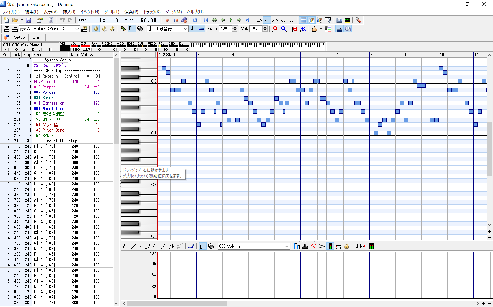

Domino を用いて midi ファイルを書き出すには、SMF 書き出しを選ぶと良い。

このとき、mid2src.py があるフォルダに保存するようにする。format は 1 にする。

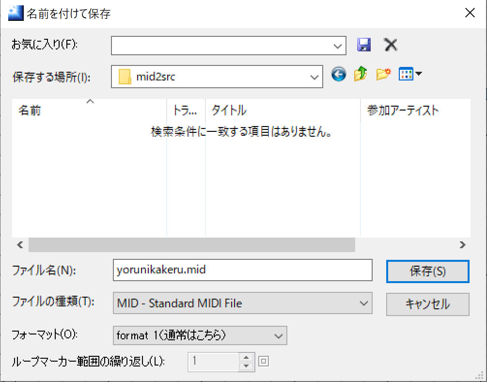
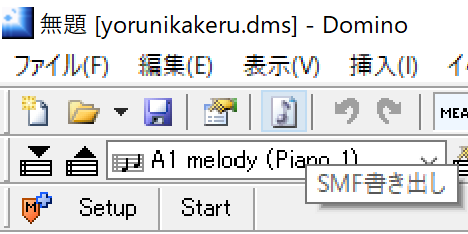

## 2. Python と必要なパッケージのインストール

- Windows

  1.  スタートメニューから Microsoft Store を起動する。

  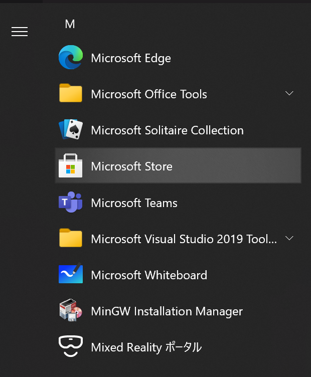

  2.  Python を検索し、インストールする。（3.x 系ならバージョンは何でもよい）

  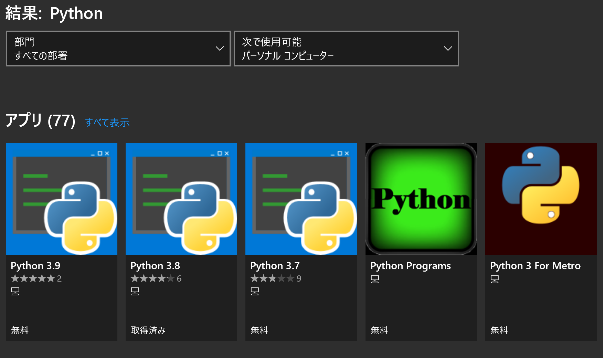
  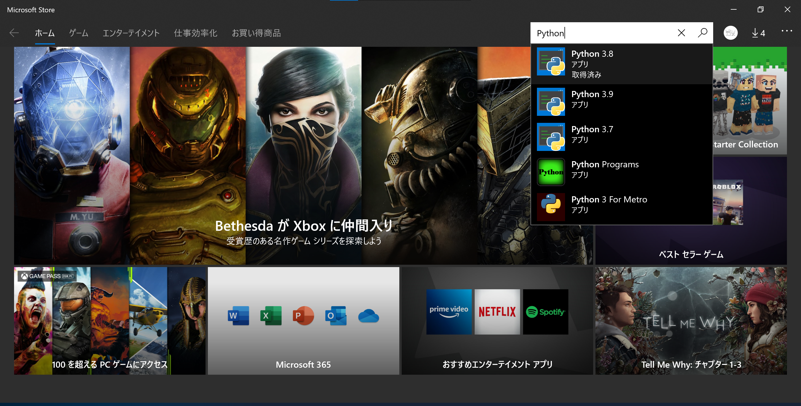
  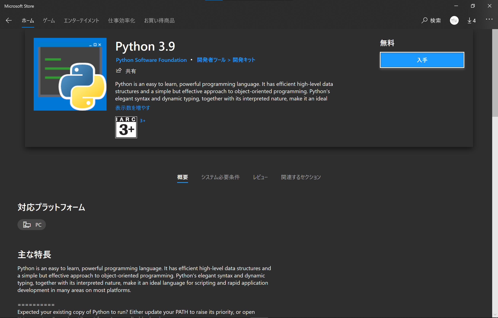

  3.  コマンドプロンプト or PowerShell を起動し、以下のコマンドを実行

  ```
  pip3 install mido
  ```

  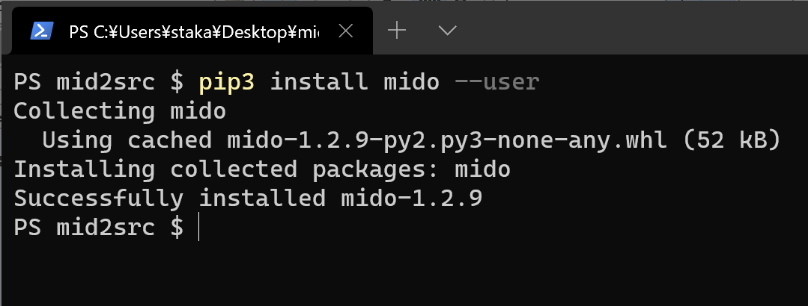

- Mac/Linux

  1.  Mac は homebrew、Linux の Ubuntu なら apt で Python をインストールする。
      コマンドは以下の通り

  - Mac
    ```
    brew install python
    pip3 install mido
    ```
  - Ubuntu 系

    ```
    sudo apt install python3
    pip3 install mido
    ```

    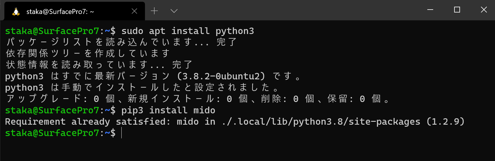

## 3. 使い方

1.  cd コマンドを使って mid2src.py のあるフォルダに移動する。このとき、同じフォルダに midi ファイルを入れておく。

    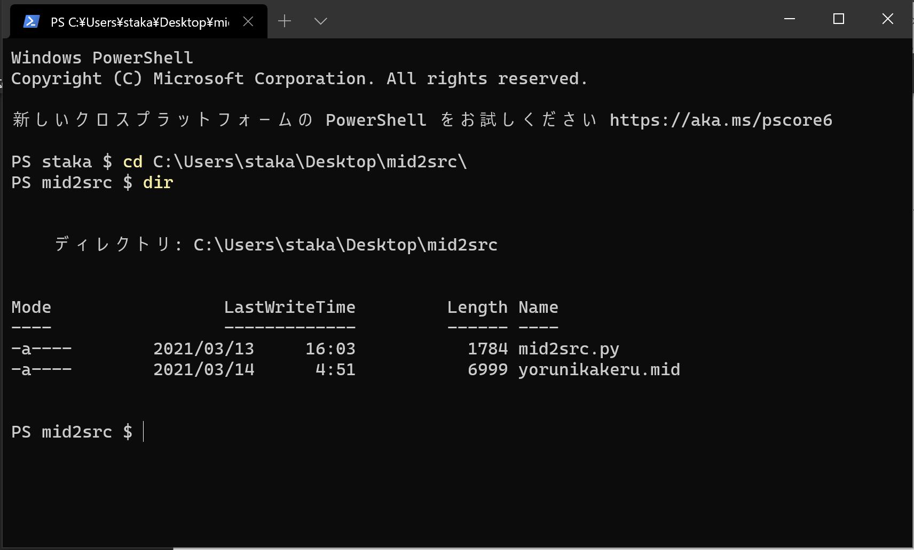

2.  以下のコマンドを実行する。

    ```
    python3 .\mid2src.py
    ```

3.  プログラムに従って入力する。トラックは打ち込みしたものを選ぶ。

    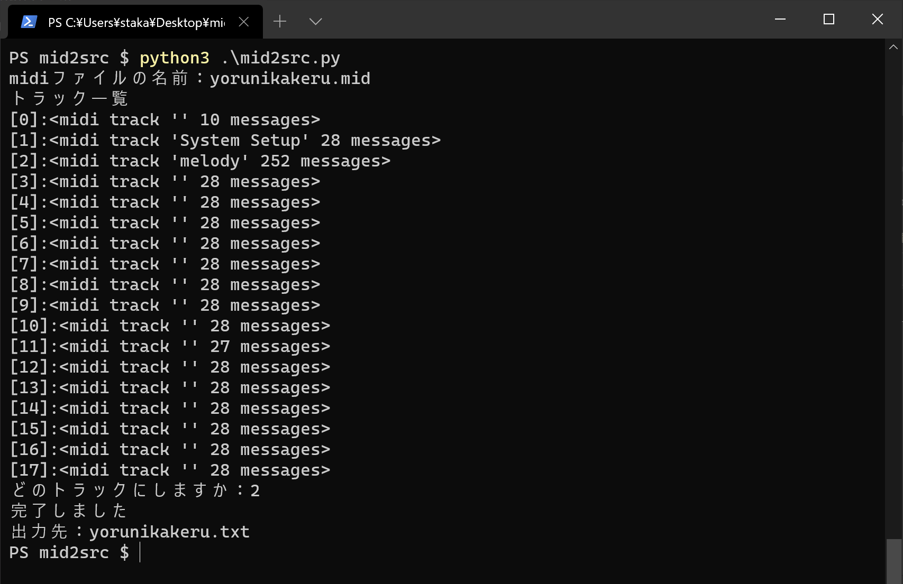
